# DevOps QR Code Generator

A full-stack QR code generation application built to demonstrate a complete DevOps pipeline — from local development to a production-grade deployment on AWS using Kubernetes.

## Live Demo

The application was deployed to AWS EKS and accessible via an AWS Elastic Load Balancer. Users can submit any URL and receive a generated QR code, stored in AWS S3.

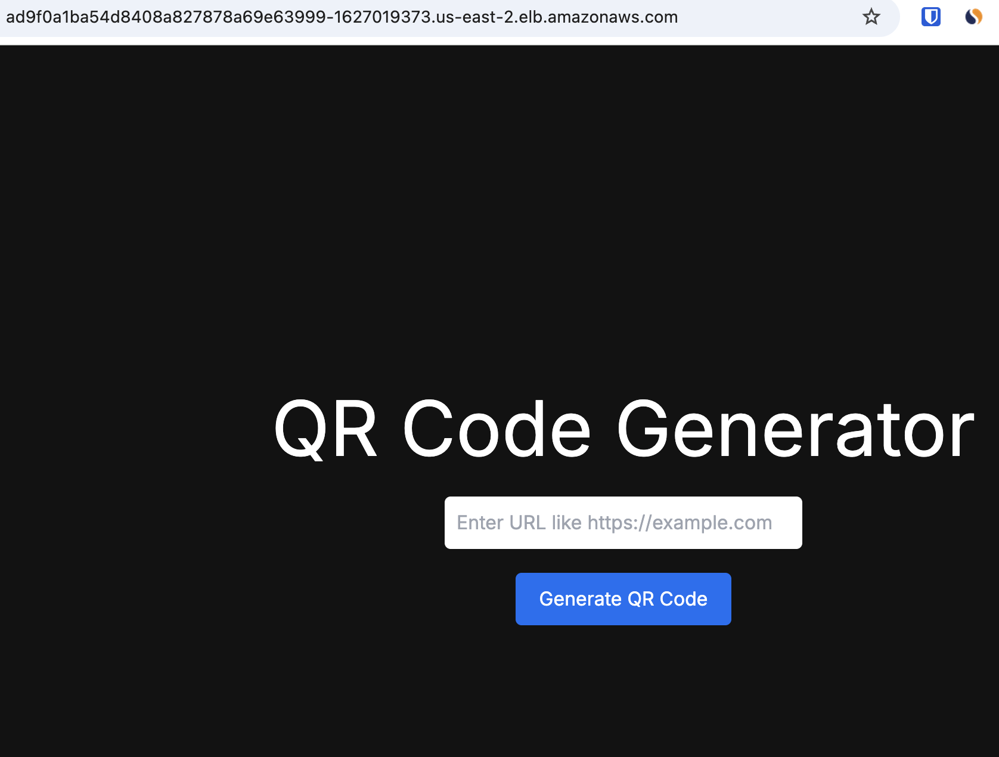
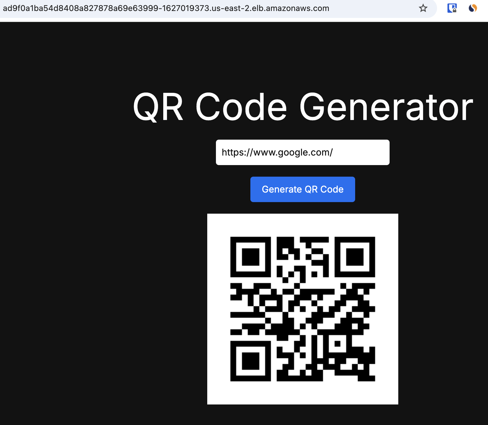

---

## Architecture

```
Internet → AWS Elastic Load Balancer → Next.js Frontend (Kubernetes Pod)
                                              ↓
                                   Next.js API Route (/api/generate-qr)
                                              ↓
                              FastAPI Backend via ClusterIP Service
                                              ↓
                                        AWS S3 Bucket
```
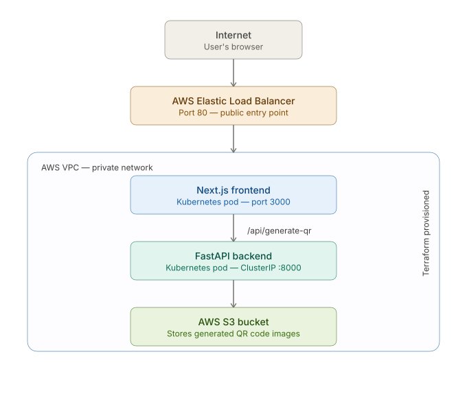

**Networking:**
```
Custom VPC (10.0.0.0/16)
├── Public Subnets (us-east-2a, us-east-2b) → Load Balancer
├── Private Subnets (us-east-2a, us-east-2b) → EKS Worker Nodes
├── Internet Gateway → Public internet access
└── NAT Gateway → Allows private subnets to reach internet securely
```

---

## Tech Stack

| Layer | Technology |
|---|---|
| Frontend | Next.js, React, Axios |
| Backend | Python, FastAPI, Uvicorn |
| Storage | AWS S3 |
| Containerization | Docker, Docker Compose |
| Container Registry | Docker Hub |
| CI/CD | GitHub Actions |
| Infrastructure as Code | Terraform |
| Container Orchestration | Kubernetes (AWS EKS) |
| Networking | Custom AWS VPC, NAT Gateway, Elastic Load Balancer |

---

## Project Structure

```
deploy-qr-code/
├── api/                          # Python FastAPI backend
│   ├── main.py                   # API endpoints
│   ├── requirements.txt          # Python dependencies
│   └── Dockerfile                # Backend container image
├── front-end-nextjs/             # Next.js frontend
│   ├── src/app/
│   │   ├── page.js               # Main UI
│   │   └── api/generate-qr/
│   │       └── route.js          # Next.js API proxy route
│   └── Dockerfile                # Frontend container image
├── terraform/                    # Infrastructure as Code
│   ├── provider.tf               # AWS provider configuration
│   ├── vpc.tf                    # Custom VPC with public/private subnets
│   └── eks.tf                    # EKS cluster and managed node group
├── kubernetes/                   # Kubernetes manifests
│   ├── frontend.yaml             # Frontend Deployment + LoadBalancer Service
│   └── backend.yaml              # Backend Deployment + ClusterIP Service
└── docker-compose.yml            # Local development orchestration
```


---

## What I Built

### 1. Application
Built a RESTful API using **Python and FastAPI** that accepts a URL via HTTP POST, generates a QR code using the `qrcode` library, uploads the image to **AWS S3** using the Boto3 SDK, and returns the public S3 URL. The frontend is built with **Next.js and React**, using a Next.js API route as a proxy to the backend to avoid CORS issues and keep the backend URL internal to the cluster.

### 2. Containerization
Wrote optimized **Dockerfiles** for both services, leveraging Docker layer caching to speed up builds. Combined both services locally using **Docker Compose** with service networking, environment variable injection via `.env` files, and a `depends_on` configuration to ensure the API starts before the frontend.

### 3. CI/CD Pipeline
Built a **GitHub Actions** workflow that triggers on every push to `main` that touches either Dockerfile. The pipeline automatically builds both Docker images and pushes them to **Docker Hub** using a personal access token stored as a GitHub repository secret.

### 4. Infrastructure as Code
Provisioned all AWS infrastructure using **Terraform** with modular `.tf` files:

- **`vpc.tf`** — Custom VPC using the `terraform-aws-modules/vpc` module with public subnets for the load balancer, private subnets for the worker nodes, a NAT gateway for secure outbound internet access, and an internet gateway for inbound traffic.
- **`eks.tf`** — Amazon EKS cluster using the `terraform-aws-modules/eks` module with a managed node group of `t3.small` EC2 instances.

### 5. Kubernetes Deployment
Wrote Kubernetes manifest files to deploy both services to EKS:

- **Frontend** — `Deployment` with 2 replicas + `LoadBalancer` Service that automatically provisions an AWS Elastic Load Balancer to expose the app publicly on port 80.
- **Backend** — `Deployment` with 2 replicas + `ClusterIP` Service for internal-only access. AWS credentials are stored securely as a Kubernetes `Secret` and injected as environment variables at runtime.

---

## AWS Screenshots

### EKS Cluster
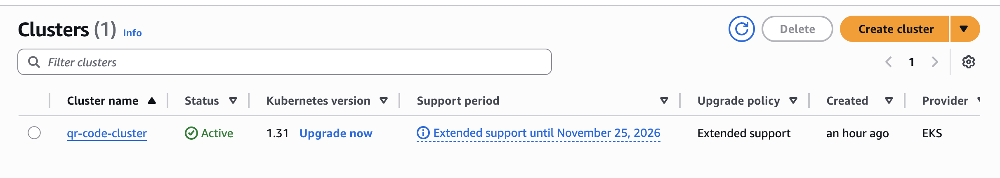

### EKS Nodes
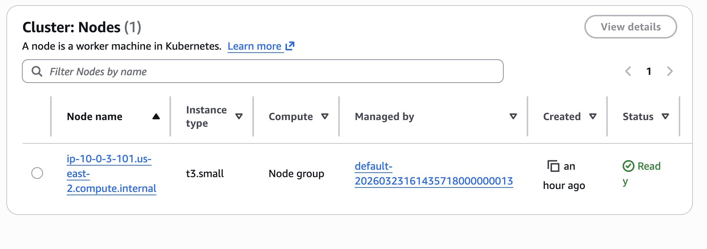

### Pods Running
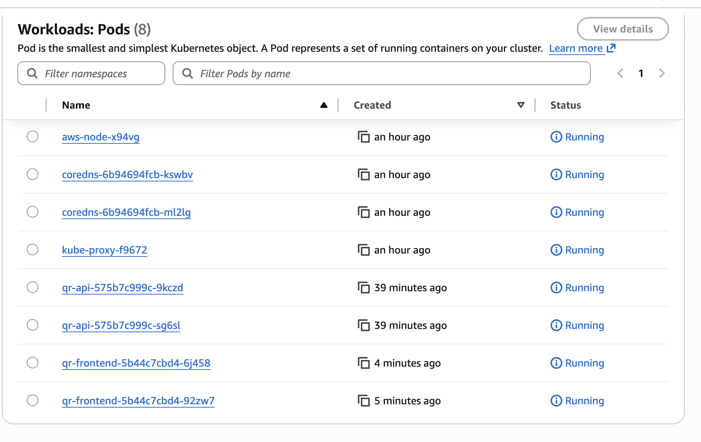

### Kubernetes Services
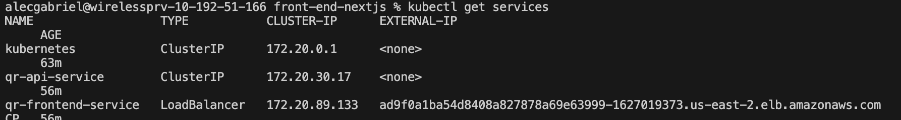

### kubectl get nodes
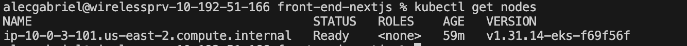

### kubectl get pods
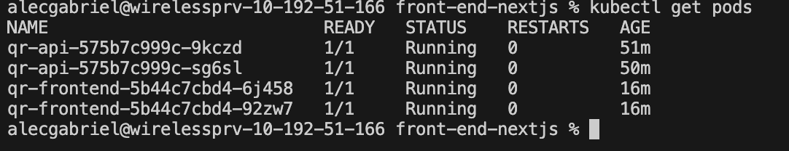

### Custom VPC
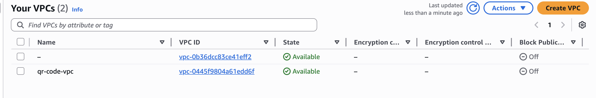

### Subnets (Public + Private across 2 AZs)
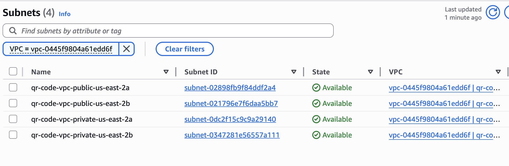

### NAT Gateway
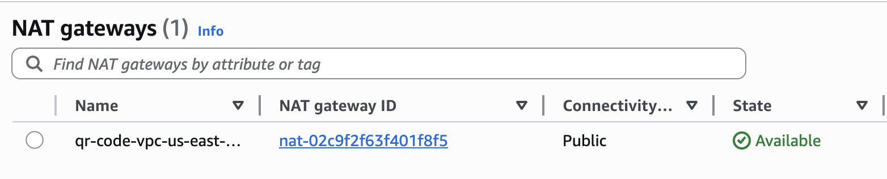

### Internet Gateway
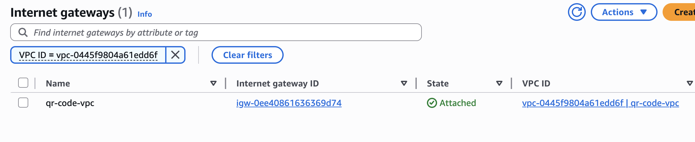

### EC2 Worker Node
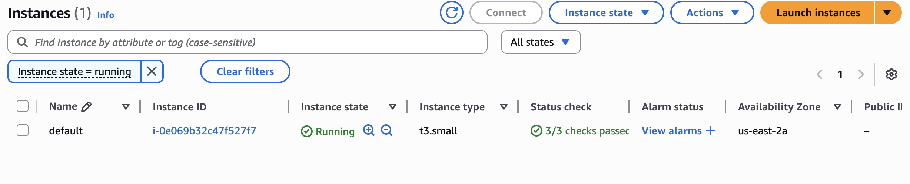

### S3 Bucket with Generated QR Codes
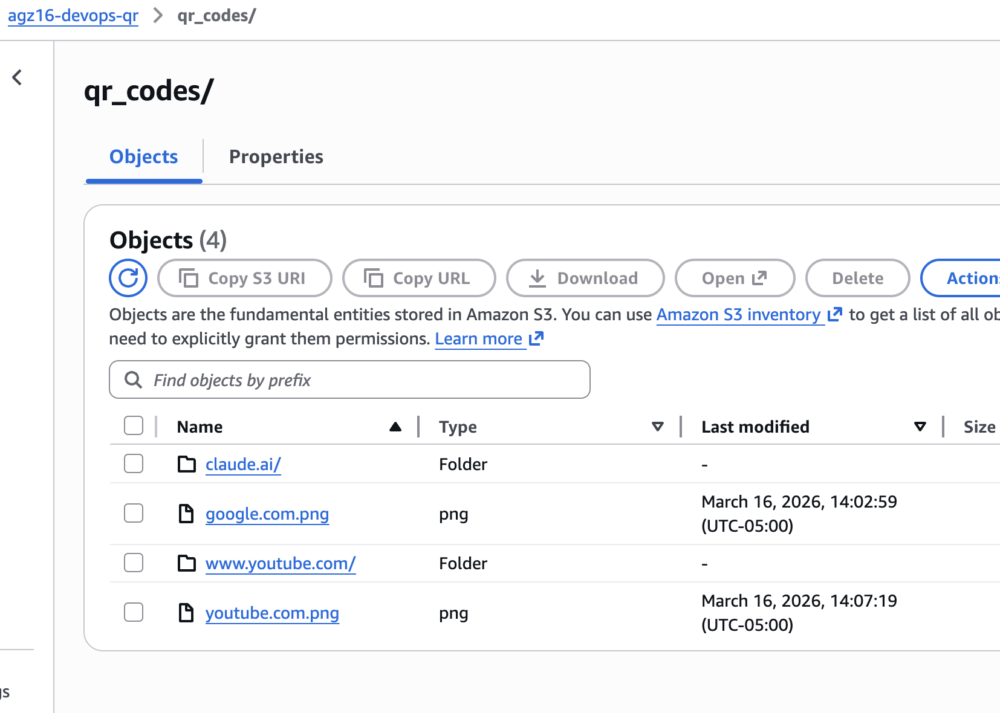

---

## Running Locally

### Prerequisites
- Docker Desktop
- AWS account with S3 bucket
- AWS access key and secret key

### Setup

1. Clone the repo:
```bash
git clone https://github.com/agz-16/deploy-qr-code
cd deploy-qr-code
```

2. Create `api/.env`:
```
AWS_ACCESS_KEY=your_access_key
AWS_SECRET_KEY=your_secret_key
BUCKET_NAME=your_bucket_name
```

3. Run with Docker Compose:
```bash
docker-compose up
```

4. Visit `http://localhost:3000`

---

## Deploying to AWS EKS

### Prerequisites
- Terraform installed
- AWS CLI configured
- kubectl installed
- Docker Hub account

### 1. Provision Infrastructure
```bash
cd terraform
terraform init
terraform apply
```

### 2. Connect kubectl to the cluster
```bash
aws eks --region us-east-2 update-kubeconfig --name qr-code-cluster
```

### 3. Create Kubernetes Secret
```bash
kubectl apply -f kubernetes/secrets.yaml
```

### 4. Deploy the app
```bash
kubectl apply -f kubernetes/backend.yaml
kubectl apply -f kubernetes/frontend.yaml
```

### 5. Get the Load Balancer URL
```bash
kubectl get services
```
Copy the `EXTERNAL-IP` of `qr-frontend-service` and open it in your browser.

### 6. Tear down when done
```bash
terraform destroy
```

---

## Author

Alec Gabriel — [GitHub](https://github.com/agz-16)
